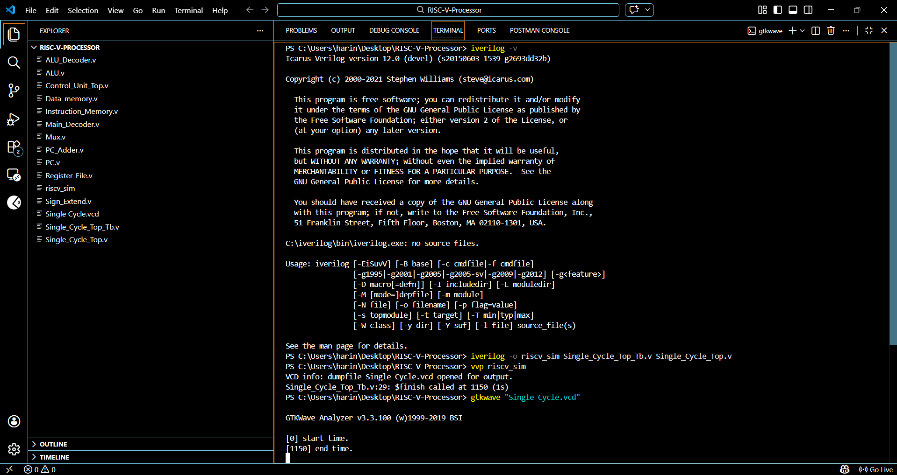
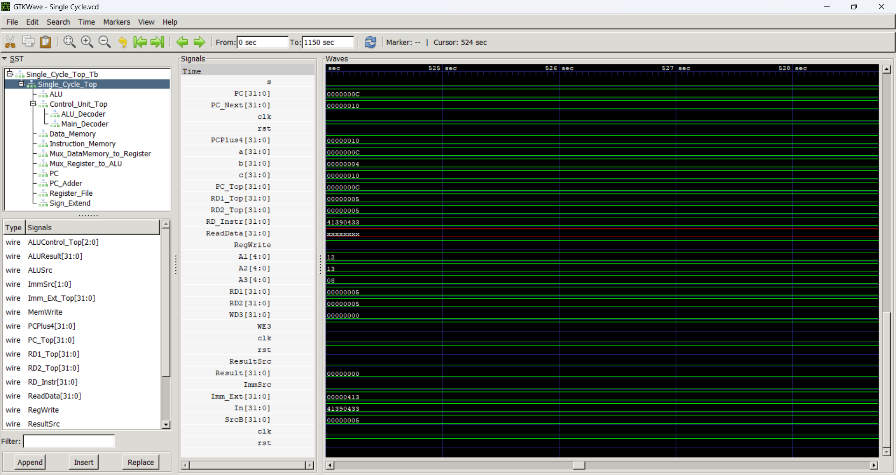
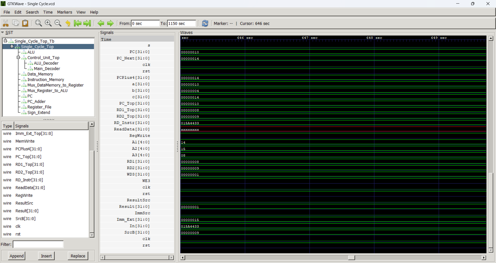

# 🚀 32-Bit Single Cycle RISC-V Processor (Verilog)hi


---

# 👨‍💻 Author

**Prudvi Reddy Poli**

[](https://www.linkedin.com/in/prudvi-reddy-poli-3b2430237/)

[](https://github.com/prudvi1916)

---

# 📌 Project Overview

This project implements a **32-bit Single Cycle RISC-V Processor** using **Verilog HDL**.

RISC-V is an **open-source Instruction Set Architecture (ISA)** based on the **Reduced Instruction Set Computer (RISC)** design philosophy.

The processor executes each instruction in **one clock cycle**, demonstrating the fundamental working of a CPU datapath and control unit.

This project helped me understand:

- Instruction execution flow
- Control signal generation
- Datapath design
- Hardware simulation using Verilog

The knowledge gained from this project will support my future work in:

**ASIC Physical Design (PD)**  
**VLSI System Design**  
**Digital IC Design**

---

# 📚 What is RISC-V?

**RISC-V** stands for:

**Reduced Instruction Set Computer – Fifth Generation**

It is an **open standard instruction set architecture** developed at the **University of California, Berkeley**.

### Key Features

| Feature | Description |
|------|------|
| Open Source | Anyone can implement it |
| Simple ISA | Easy to design processors |
| Modular Design | Extensions can be added |
| Efficient | Optimized for performance and power |

RISC-V processors are widely used in:

- Embedded systems
- Microcontrollers
- AI accelerators
- Custom ASIC designs

---

# 🧠 RISC-V Processor Architecture

Below is the architecture of the designed **Single Cycle RISC-V Processor**.

<p align="center">

</p>

The processor contains the following main modules:

- **Program Counter (PC)** – Holds the address of the current instruction
- **Instruction Memory** – Stores instructions to be executed
- **Register File** – Stores general purpose registers
- **Control Unit** – Generates control signals
- **ALU** – Performs arithmetic and logical operations
- **Data Memory** – Stores data values
- **Multiplexers** – Select datapath inputs
- **Sign Extend Unit** – Converts immediates to 32-bit values

---

# 🔁 Processor Datapath (Simplified)

```
PC → Instruction Memory → Register File → ALU → Data Memory → Write Back
```

Instruction stages:

```
Fetch → Decode → Execute → Memory → Write Back
```

---

# 🖥️ Simulation using Icarus Verilog

The processor was compiled and simulated using **Icarus Verilog** from the VS Code terminal.

<p align="center">

</p>

The simulation generates a **VCD waveform file** used for analyzing processor behavior.

---

# 📊 Simulation Waveforms (GTKWave)

The generated waveform file (`Single Cycle.vcd`) was analyzed using **GTKWave**.

### Waveform Observation

<p align="center">

</p>

<p align="center">

</p>

The waveform verifies:

- Program Counter updates
- Instruction fetch
- ALU operations
- Register write-back
- Memory access

---

# 📂 Project Structure

```
RISC-V-Processor
│
├── ALU.v
├── ALU_Decoder.v
├── Control_Unit_Top.v
├── Data_memory.v
├── Instruction_Memory.v
├── Main_Decoder.v
├── Mux.v
├── PC.v
├── PC_Adder.v
├── Register_File.v
├── Sign_Extend.v
├── Single_Cycle_Top.v
├── Single_Cycle_Top_Tb.v
│
├── Images
│   ├── riscv-processor-architecture.png
│   ├── terminal-simulation.png
│   ├── gtkwave-waveform-1.png
│   └── gtkwave-waveform-2.png
│
└── README.md
```

---

# ⚙️ Tools Used

| Tool | Purpose |
|-----|------|
| Verilog HDL | Hardware description |
| Icarus Verilog | Simulation |
| GTKWave | Waveform visualization |
| VS Code | Code development |

---

# 🧰 Installation Guide (Windows)

### Install Icarus Verilog

Download from:

```
https://bleyer.org/icarus/
```

The installer usually **includes GTKWave**, so a separate installation is not required.

Verify installation:

```bash
iverilog -v
```

---

# ▶ Running the Simulation

### Step 1 — Compile

```bash
iverilog -o riscv_sim Single_Cycle_Top_Tb.v Single_Cycle_Top.v
```

---

### Step 2 — Run simulation

```bash
vvp riscv_sim
```

This generates the waveform file:

```
Single Cycle.vcd
```

---

### Step 3 — View waveform

```bash
gtkwave "Single Cycle.vcd"
```

Observed signals:

```
clk
rst
PC
Instruction
ALUResult
Register outputs
Memory data
```

---

# 🧩 Supported ALU Operations

| Operation | Description |
|------|------|
| ADD | Addition |
| SUB | Subtraction |
| AND | Logical AND |
| OR | Logical OR |
| XOR | Logical XOR |
| SLT | Set Less Than |

---

# 🚀 Future Improvements

Possible future improvements include:

- Pipelined RISC-V processor
- Branch prediction
- Cache memory integration
- Hazard detection
- Support for additional RISC-V instructions

---

# ⭐ Acknowledgment

This project was developed as a **learning exercise to understand processor architecture and RISC-V instruction execution**, which will support my work in **VLSI and ASIC Physical Design**.

---

⭐ If you find this project useful, please **consider starring the repository**.
